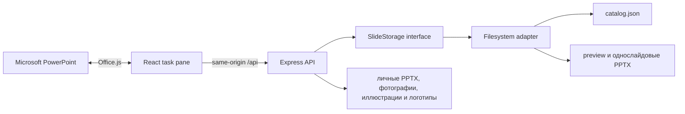

# Корпоративная библиотека слайдов для PowerPoint

## Что это такое

Slide Library — локальный MVP корпоративной библиотеки слайдов, работающий как task pane-надстройка внутри Microsoft PowerPoint.

Пользователь может:

- открыть каталог корпоративных слайдов;
- искать и фильтровать материалы;
- просматривать preview и метаданные;
- вставлять зарегистрированный однослайдовый `.pptx` в текущую презентацию.

Это именно MVP для локальной демонстрации и пилота внутри одного подразделения. Проект уже содержит рабочий пользовательский сценарий, но до полноценного корпоративного продукта ещё предстоит реализовать много функций: SSO, права доступа, SharePoint/OneDrive, админ-панель, workflow согласования, аналитику и production-развёртывание.

## Какую проблему решает проект

Команды часто переиспользуют слайды, находя старые презентации и копируя материалы вручную. Из-за этого сложно понять, какая версия слайда актуальна, утверждены ли данные и соответствует ли оформление текущему фирменному стилю.

MVP предоставляет единый локальный каталог с метаданными, статусом утверждения, preview и редактируемым исходным PowerPoint-слайдом непосредственно внутри PowerPoint.

## Возможности текущего MVP

- карточки слайдов с ленивой загрузкой preview;
- поиск по названию, описанию, категории, тегам и `searchText`;
- фильтрация по категории и статусу `approved`, `draft`, `deprecated`;
- сортировка и переключение между плиточным и списочным режимами;
- локальное избранное с сохранением между перезапусками панели;
- отображение версии, даты обновления, владельца, автора, отдела и языка;
- увеличенный preview и диалог подробной информации;
- состояния загрузки, ошибки API, пустого каталога, отсутствующих preview и результатов поиска;
- реальная загрузка PPTX и вставка через Office.js;
- выбор и последовательная вставка нескольких слайдов;
- кликабельные разделы личной библиотеки для загрузки и вставки PPTX, фотографий, иллюстраций и логотипов;
- удаление личных материалов с отдельным подтверждением;
- проверка формата и ограничение личных файлов размером 20 МБ;
- сохранение исходного форматирования слайда;
- browser mode для разработки без PowerPoint;
- файловое хранилище с JSON-каталогом;
- проверка схемы, duplicate ID, зарегистрированных файлов и безопасных путей;
- автоматическое обновление каталога после изменения `catalog.json`;
- CLI для проверки и обновления библиотеки;
- структурированные серверные логи без записи содержимого PPTX и Base64.

## Архитектура



Надстройка никогда не передаёт серверу произвольный путь к файлу. Binary endpoints принимают только ID элемента каталога, а сервер отдаёт только файлы, зарегистрированные в валидированном каталоге.

PowerPoint-интеграция изолирована за интерфейсом `PowerPointService`: он вставляет публичные и личные PPTX, а также добавляет фотографии, иллюстрации и логотипы на текущий слайд. UI и API продолжают работать в обычном браузере без Office.js.

Подробные схемы находятся в [ARCHITECTURE.md](docs/ARCHITECTURE.md) и [TECHNICAL_PLAN.md](docs/TECHNICAL_PLAN.md).

## Технологический стек

- npm workspaces, Node.js и TypeScript;
- React и Vite для task pane;
- Office.js и `PowerPointApi 1.2`;
- Express и Zod для API и runtime-валидации;
- Vitest, React Testing Library, ESLint и TypeScript checks;
- JSON-метаданные, PPTX-файлы и PNG/JPEG/WebP preview.

## Требования

Для browser mode:

- Node.js 20 или новее;
- npm;
- современный desktop-браузер.

Для реальной вставки слайдов:

- установленный Microsoft PowerPoint;
- PowerPoint с поддержкой `PowerPointApi 1.2`;
- возможность developer sideloading;
- доступ к локальному HTTPS-сертификату для `https://localhost:3000`.

Для необязательного импортера презентаций:

- Windows;
- установленный desktop PowerPoint;
- доступная COM automation.

Официальная документация: [`insertSlidesFromBase64`](https://learn.microsoft.com/en-us/javascript/api/powerpoint/powerpoint.presentation) и [матрица PowerPoint requirement sets](https://learn.microsoft.com/en-us/javascript/api/requirement-sets/powerpoint/powerpoint-api-requirement-sets).

## Запуск проекта

### 1. Клонирование и установка

Открой PowerShell и перейди в корень проекта:

```powershell
git clone https://github.com/w3L1k/corporate_slide_library.git
cd corporate_slide_library
```

Установи зависимости:

```powershell
npm install
```

Во время `npm install` автоматически собирается пакет общих типов `@slide-library/shared`.

Проверь, что установка завершилась без ошибок:

```powershell
npm run validate-library
npm run validate-manifest
```

### 2. Browser mode — быстрый запуск без PowerPoint

Для демонстрации каталога, поиска, фильтров и preview запусти:

```powershell
npm run dev:browser
```

Команда запускает два процесса:

- API: `http://127.0.0.1:3001`;
- Vite UI: `http://localhost:3000`.

Открой в браузере:

```text
http://localhost:3000
```

В browser mode появится уведомление **Catalog preview mode**. Это нормально: каталог работает, но вставка в презентацию намеренно недоступна, потому что браузер не является PowerPoint host.

Остановить оба процесса можно через `Ctrl+C`.

### 3. Запуск внутри PowerPoint

Для реальной вставки используй HTTPS-режим:

```powershell
npm run dev
```

Эта команда:

1. собирает shared package;
2. устанавливает или проверяет локальный development certificate;
3. запускает API на `http://127.0.0.1:3001`;
4. запускает Vite task pane на `https://localhost:3000`.

В терминале должны появиться сообщения примерно такого вида:

```text
Catalog loaded
Slide library server is listening
Local: https://localhost:3000/
```

Не закрывай этот терминал во время работы надстройки.

### 4. Sideload надстройки

Открой второе окно PowerShell в корне проекта и выполни:

```powershell
npm run sideload
```

После этого:

1. открой PowerPoint;
2. создай новую презентацию или открой существующую;
3. перейди на вкладку **Главная**;
4. нажми **Open Slide Library** в группе **Slide Library**;
5. справа откроется task pane библиотеки.

Если команда не появилась сразу, закрой и снова открой PowerPoint. Расположение кнопки может отличаться в разных версиях Office.

### 5. Проверка вставки

В task pane:

1. введи в поиск `Revenue`;
2. открой карточку **Revenue Overview** или нажми **Insert**;
3. дождись окончания операции;
4. проверь, что в презентации появился один редактируемый слайд;
5. проверь, что сохранилось исходное форматирование.

Во время вставки надстройка:

1. скачивает PPTX только после нажатия Insert;
2. преобразует файл в Base64;
3. вызывает `PowerPoint.run`;
4. вызывает `insertSlidesFromBase64` с `KeepSourceFormatting`;
5. выполняет `context.sync()`.

Личные материалы проверяются отдельно:

1. открой вкладку **Личное**;
2. загрузи PPTX, фотографию, иллюстрацию или логотип;
3. нажми **Добавить** на карточке материала;
4. PPTX будет вставлен как слайды с исходным форматированием, а фотография, иллюстрация или логотип появится на текущем слайде;
5. для SVG требуется поддержка `ImageCoercion 1.2`; если её нет, надстройка предложит использовать PNG.

Ошибочно загруженный личный материал можно удалить кнопкой с корзиной на его карточке. Перед удалением интерфейс обязательно запрашивает подтверждение.

После завершения работы останови sideload:

```powershell
npm run sideload:stop
```

Если надстройка показывает **Catalog preview mode** внутри PowerPoint, закрой task pane, перезапусти `npm run dev` и снова открой надстройку через **Open Slide Library**.

### 6. Если порт уже занят

Vite использует порт `3000`, API — порт `3001`. Проверить занятый порт:

```powershell
Get-NetTCPConnection -LocalPort 3000 -State Listen
Get-NetTCPConnection -LocalPort 3001 -State Listen
```

Узнать процесс по его ID:

```powershell
Get-Process -Id <PID>
```

Если это старый процесс проекта, его можно остановить:

```powershell
Stop-Process -Id <PID> -Force
```

После этого снова запусти:

```powershell
npm run dev
```

### 7. Если сертификат localhost не доверен

Выполни:

```powershell
npm run certs:ensure
```

Затем перезапусти `npm run dev`. Если PowerPoint показывает предупреждение о сертификате, доверься локальному development certificate в Windows и повторно открой надстройку.

## Быстрая проверка API

```powershell
# Health check
curl http://127.0.0.1:3001/api/health

# Каталог из 12 demo-слайдов
curl http://127.0.0.1:3001/api/slides

# Поиск
curl "http://127.0.0.1:3001/api/slides?q=revenue"

# Фильтр по категории
curl "http://127.0.0.1:3001/api/slides?category=Finance"

# Preview
curl -I http://127.0.0.1:3001/api/slides/company-overview/preview

# Один элемент
curl http://127.0.0.1:3001/api/slides/company-overview
```

## Настройка хранилища слайдов

По умолчанию используется встроенная папка `data/`.

Для локальной настройки создай `.env` из примера:

```powershell
Copy-Item .env.example .env
```

Пример:

```dotenv
HOST=127.0.0.1
PORT=3001
SLIDE_LIBRARY_PATH=C:\CorporateSlideLibrary
CORS_ORIGINS=https://localhost:3000,http://localhost:3000,http://127.0.0.1:3000
ENABLE_ADMIN_REINDEX=false
VITE_API_BASE_URL=
```

Структура библиотеки:

```text
library-root/
  catalog.json
  slides/
    one-item.pptx
  previews/
    one-item.png
```

Один элемент каталога должен соответствовать одному однослайдовому PPTX. Текущий валидатор проверяет метаданные, расширения, наличие файлов и безопасное расположение, но не открывает PPTX для автоматического подсчёта слайдов.

## Добавление нового слайда

1. Сохрани утверждённый слайд как однослайдовый `.pptx` в `<library>/slides/`.
2. Экспортируй соответствующий preview в PNG, JPEG или WebP.
3. Добавь объект в `<library>/catalog.json` с уникальным kebab-case ID.
4. Проверь библиотеку:

   ```powershell
   npm run validate-library -- --path "C:\CorporateSlideLibrary"
   ```

5. Обнови task pane. Сервер обнаружит изменение каталога при следующем API-запросе.

Для разбиения существующей многостраничной презентации на отдельные элементы можно использовать Windows importer:

```powershell
npm run import-pptx -- -SourcePptx "C:\Input\source.pptx" -LibraryRoot "C:\CorporateSlideLibrary"
```

Импортер создаёт однослайдовые PPTX, preview и черновые метаданные в `catalog.imported.json`. Он не публикует новые элементы автоматически — перед публикацией их нужно проверить.

## Проверки качества

Полная проверка проекта:

```powershell
npm run check
```

Она запускает:

- валидацию каталога;
- валидацию manifest;
- lint;
- typecheck server, add-in и tools;
- автоматические тесты;
- production build.

Отдельные команды:

```powershell
npm run validate-library
npm run validate-manifest
npm run lint
npm run typecheck
npm run test
npm run build
```

Автоматические тесты не заменяют ручную проверку в PowerPoint. Ручной checklist находится в [docs/FINAL_CHECKLIST.md](docs/FINAL_CHECKLIST.md).

## Текущий статус MVP

Готово и работает:

- локальный API и файловый каталог;
- поиск, фильтры и preview;
- task pane надстройка;
- browser mode;
- manifest и sideload-конфигурация;
- Office.js-сервис вставки;
- одиночная и множественная вставка;
- избранное;
- загрузка, вставка и удаление личных презентаций, фотографий, иллюстраций и логотипов;
- обработка ошибок и состояния UI;
- автоматические проверки и demo-данные.

Ограничения текущего MVP:

- нет enterprise SSO;
- нет RBAC и разграничения доступа;
- нет SharePoint/OneDrive connector;
- нет admin UI и workflow согласования;
- нет истории версий и аналитики использования;
- публикация контента выполняется вручную через файлы;
- локальный development certificate не подходит для production;
- полноценная матрица проверки разных версий PowerPoint ещё не сформирована.

Подробнее об ограничениях — в [MVP_LIMITATIONS.md](docs/MVP_LIMITATIONS.md).

## Что будем делать дальше

### Этап 1 — текущий MVP

- локальный каталог;
- поиск и фильтры;
- preview;
- вставка слайда в PowerPoint;
- базовая валидация и документация.

### Этап 2 — пилот подразделения

- SharePoint или OneDrive вместо локальной файловой системы;
- корпоративная авторизация и SSO;
- владельцы контента и процесс согласования;
- история обновлений;
- аналитика использования слайдов;
- управляемое HTTPS-развёртывание.

### Этап 3 — масштабирование организации

- RBAC и несколько подразделений;
- централизованная публикация и version history;
- рекомендации и умный поиск;
- deployment через корпоративный Office admin center;
- мониторинг, аудит и политики безопасности.

Подробный план находится в [PILOT_ROADMAP.md](docs/PILOT_ROADMAP.md).

## Документация

- [Архитектура](docs/ARCHITECTURE.md)
- [Технический план](docs/TECHNICAL_PLAN.md)
- [Workflow работы с контентом](docs/CONTENT_WORKFLOW.md)
- [Ограничения MVP](docs/MVP_LIMITATIONS.md)
- [Roadmap пилота](docs/PILOT_ROADMAP.md)
- [Сценарий демо](docs/DEMO_GUIDE.md)
- [Финальный checklist](docs/FINAL_CHECKLIST.md)

## Важное замечание

Этот репозиторий — демонстрационный локальный MVP, а не готовая production-система для всей организации. Его задача — доказать основной сценарий:

```text
запустить локально
→ открыть PowerPoint
→ открыть Slide Library
→ найти слайд
→ посмотреть preview
→ вставить слайд в презентацию
```

Следующие функции будут добавляться поэтапно после подтверждения базового сценария на пилоте.
