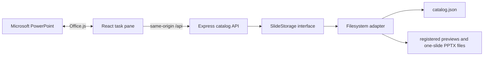

# Slide Library for PowerPoint

## What it is

Slide Library is a local pilot MVP of a corporate slide catalog delivered as a Microsoft PowerPoint task-pane add-in. A user can browse governed content, search and filter it, inspect metadata and a large preview, and insert the registered one-slide `.pptx` into the open presentation.

The repository includes a React/TypeScript add-in, an Express/TypeScript API, shared validated domain types, 12 demo items, content-validation tools, and a browser-only development fallback.

## Problem

Teams commonly reuse slides by searching old decks and copying content manually. That makes it difficult to know which version, data, wording, or visual treatment is current. This MVP makes catalog metadata, approval status, previews, and editable PowerPoint source files available from one place inside PowerPoint.

## MVP capabilities

- Catalog cards with lazy-loaded previews, category, status, and update date.
- Debounced text search across title, description, category, tags, and optional `searchText`.
- Case-insensitive category filtering and `approved`, `draft`, or `deprecated` status filtering.
- An accessible details dialog with version, ownership fields, tags, and a larger preview.
- Loading, API-error/retry, empty-catalog, no-results, missing-preview, inserting, success, and failure states.
- Real PPTX download and insertion through Office.js, using `insertSlidesFromBase64` with source formatting retained.
- Browser preview mode that exercises the catalog without pretending that PowerPoint insertion is available.
- A configurable filesystem library with schema validation, duplicate-ID checks, registered-file checks, and path-containment enforcement.
- Automatic catalog reload after a normal `catalog.json` modification, an explicit pilot refresh endpoint, and content-owner CLI tools.
- Structured server logs without logging PPTX bodies or Base64 data.

## Architecture



The add-in never sends a filesystem path. Binary routes accept a validated catalog ID, and the server resolves only the paths registered in the validated catalog. Office-specific behavior is isolated behind `PowerPointService`, so the UI and API remain usable in an ordinary browser.

See [Architecture](docs/ARCHITECTURE.md) and the existing [technical plan](docs/TECHNICAL_PLAN.md) for the detailed boundaries and request flows.

## Tech stack

- npm workspaces; Node.js and TypeScript.
- React and Vite for the task pane.
- Office.js and the `PowerPointApi 1.2` requirement set.
- Express and Zod for the API and runtime contracts.
- Vitest, React Testing Library, ESLint, and TypeScript quality gates.
- JSON metadata plus local PPTX and PNG/JPEG/WebP files for pilot storage.

## Prerequisites

- Node.js 20 or newer and npm.
- For browser development: a current desktop browser.
- For real insertion: a PowerPoint host that supports `PowerPointApi 1.2` and permits developer sideloading.
- For the optional bulk importer: Windows desktop PowerPoint with COM automation available.

Microsoft documents `insertSlidesFromBase64` as part of [`PowerPoint.Presentation`](https://learn.microsoft.com/en-us/javascript/api/powerpoint/powerpoint.presentation), and lists its host/build availability in the [PowerPoint requirement-set matrix](https://learn.microsoft.com/en-us/javascript/api/requirement-sets/powerpoint/powerpoint-api-requirement-sets).

## Quick start

From the repository root:

```powershell
npm install
npm run dev:browser
```

Open <http://localhost:3000>. With `SLIDE_LIBRARY_PATH` unset or empty, the API uses the bundled `data/` demo library. Browser mode shows an explicit **Catalog preview mode** notice; pressing **Insert** explains that a PowerPoint host is required and does not fake an insertion.

Stop both development processes with `Ctrl+C` in the terminal.

### Smoke test

```powershell
# API catalogue (12 items)
curl http://localhost:3001/api/slides

# Text search
curl "http://localhost:3001/api/slides?q=revenue"

# Category filter
curl "http://localhost:3001/api/slides?category=Finance"

# Preview image
curl -I http://localhost:3001/api/slides/company-overview/preview

# Single item
curl http://localhost:3001/api/slides/company-overview

# Full gate
npm run check
```

## Browser development mode

`npm run dev:browser` builds the shared package, then starts:

- the API at `http://127.0.0.1:3001` by default;
- Vite at `http://localhost:3000`;
- a Vite `/api` proxy to `http://localhost:3001`.

This mode needs no Office host and no development certificate. It is the recommended fallback for UI, search, filter, preview, empty/error-state, and API demonstrations. It cannot verify Office.js insertion.

## Running inside PowerPoint

The add-in-only XML manifest is at `apps/addin/manifest.xml`. It points to `https://localhost:3000`, requests `ReadWriteDocument`, and declares `PowerPointApi` version `1.2`.

1. Install dependencies and validate the manifest.

   ```powershell
   npm install
   npm run validate-manifest
   ```

2. Start the HTTPS task pane and local API. On first use, allow the development-certificate tool to install/trust its localhost certificate.

   ```powershell
   npm run dev
   ```

3. In a second terminal, start the desktop sideload session.

   ```powershell
   npm run sideload
   ```

4. In PowerPoint, open or create a presentation. If the pane does not open automatically, use **Home → Open Slide Library** (the exact ribbon overflow location can vary by PowerPoint build).
5. Search or filter, open an item, and press **Insert**. The service downloads the registered PPTX only at that point, converts it to Base64, and calls Office.js with `KeepSourceFormatting`.
6. End the developer sideload session when finished.

   ```powershell
   npm run sideload:stop
   ```

Keep `npm run dev` running throughout the session. The `sideload` script uses `office-addin-debugging`; its first invocation may require network access to obtain that tool.

If automated desktop sideload is unavailable, follow Microsoft's [Windows network-share sideload procedure](https://learn.microsoft.com/en-us/office/dev/add-ins/testing/create-a-network-shared-folder-catalog-for-task-pane-and-content-add-ins): place the XML manifest in a shared-folder catalog, trust that catalog in PowerPoint, restart PowerPoint, then add **Slide Library** from **Home → Add-ins → Advanced → Shared Folder**. Network-share sideload is for Windows testing, not production deployment. Microsoft also documents [manual sideloading in Office on the web](https://learn.microsoft.com/en-us/office/dev/add-ins/testing/sideload-office-add-ins-for-testing).

## Configuring slide storage

Copy the example only when you need local overrides:

```powershell
Copy-Item .env.example .env
```

```dotenv
HOST=127.0.0.1
PORT=3001
SLIDE_LIBRARY_PATH=C:\CorporateSlideLibrary
CORS_ORIGINS=https://localhost:3000,http://localhost:3000,http://127.0.0.1:3000
ENABLE_ADMIN_REINDEX=false
VITE_API_BASE_URL=
```

- `HOST` defaults to `127.0.0.1`; set another interface only for an intentionally network-accessible pilot.
- `SLIDE_LIBRARY_PATH` may be absolute or relative to the process working directory. Empty/unset selects `data/`.
- `CORS_ORIGINS` is a comma-separated allowlist for direct browser calls. CORS is not authentication.
- `ENABLE_ADMIN_REINDEX=true` exposes unauthenticated `POST /api/admin/reindex`; use it only in a controlled local pilot.
- Empty `VITE_API_BASE_URL` uses the Vite `/api` proxy. A direct API URL must also satisfy CORS and, inside the HTTPS task pane, must not introduce mixed content.
- Advanced development: `VITE_API_PROXY_TARGET` changes the Vite proxy target from its default `http://localhost:3001`.

The library directory must contain:

```text
library-root/
  catalog.json
  slides/
    one-item.pptx
  previews/
    one-item.png
```

Each catalog item represents exactly one slide, and its source PPTX must contain exactly one slide. The current validator enforces metadata, registered-file existence, file type, and containment, but it does not open the PPTX to prove that invariant.

## Adding a new slide

Manual, cross-platform workflow:

1. Save the approved slide as a one-slide `.pptx` under `<library>/slides/`.
2. Export a matching PNG, JPEG, or WebP preview under `<library>/previews/`.
3. Add one metadata object to `<library>/catalog.json`; use a unique kebab-case ID and relative forward-slash paths.
4. Validate before publishing:

   ```powershell
   npm run validate-library -- --path "C:\CorporateSlideLibrary"
   ```

5. Refresh the task pane. The running server normally notices a changed catalog signature on the next request.

Optional Windows importer for an existing multi-slide deck:

```powershell
npm run import-pptx -- -SourcePptx "C:\Input\source.pptx" -LibraryRoot "C:\CorporateSlideLibrary"
```

The importer uses installed PowerPoint through COM, creates one-slide PPTX files plus 1280×720 PNG previews, and writes draft metadata to `catalog.imported.json`. Review that generated metadata and merge selected items into `catalog.json`; the tool intentionally does not publish them automatically. Add `-Category`, `-Owner`, or `-Overwrite` when needed.

For the exact schema, safe publication order, refresh behavior, rollback notes, and the honest meaning of `reindex-library`, see [Content workflow](docs/CONTENT_WORKFLOW.md).

## Tests

Run the complete repository gate before calling the MVP ready:

```powershell
npm run check
```

It runs library validation, Microsoft manifest validation, lint, server/add-in/tools type checking, automated tests, and production builds. Individual commands are also available:

```powershell
npm run validate-library
npm run validate-manifest
npm run lint
npm run typecheck
npm run test
npm run build
```

Microsoft's reference for the manifest validator is [Validate an Office Add-in's manifest](https://learn.microsoft.com/en-us/office/dev/add-ins/testing/troubleshoot-manifest).

Automated tests do not replace a live PowerPoint smoke test. The tracked manual checks are in [Final checklist](docs/FINAL_CHECKLIST.md).

Latest verified repository gate: `npm run check` passes library and manifest validation, lint (0 errors), type checking, 71 tests (50 server + 21 add-in), and all builds; `npm audit` reports 0 known vulnerabilities. A `postinstall` hook automatically builds `@slide-library/shared` so new clones need only `npm install`. Browser and live PowerPoint/sideload checks remain separately tracked because they require manual/external-host evidence.

## Known limitations

This is a local/department pilot, not a production deployment. It has no SSO, RBAC, admin UI, approval workflow, usage analytics, or SharePoint connector; previews and catalog publication remain content-owner responsibilities. Browser mode cannot insert a slide, and live insertion requires a host that supports `PowerPointApi 1.2`. See [MVP limitations](docs/MVP_LIMITATIONS.md) for the distinction between designed scope limits, deployment risks, and confirmed bugs.

## Production roadmap

The extension path keeps the public API and UI stable while replacing `FileSystemSlideStorage` with an authenticated SharePoint-backed adapter. Department governance, Entra ID, telemetry, deployment, and then organization-scale workflows are staged separately in the [Pilot roadmap](docs/PILOT_ROADMAP.md).

For a short presentation of the MVP, use the [2–4 minute demo guide](docs/DEMO_GUIDE.md).
