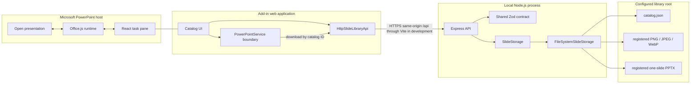
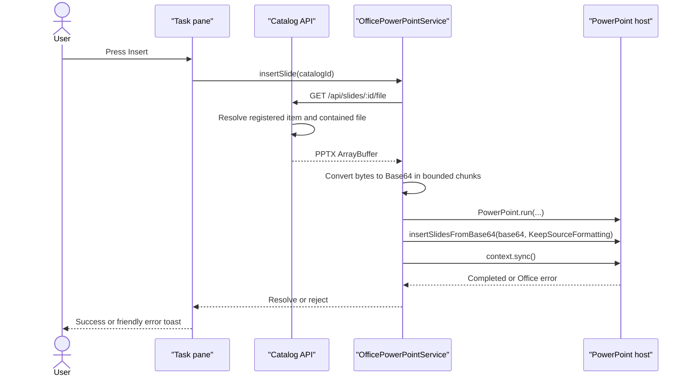
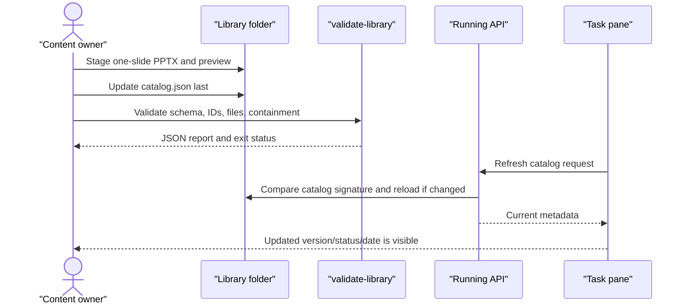
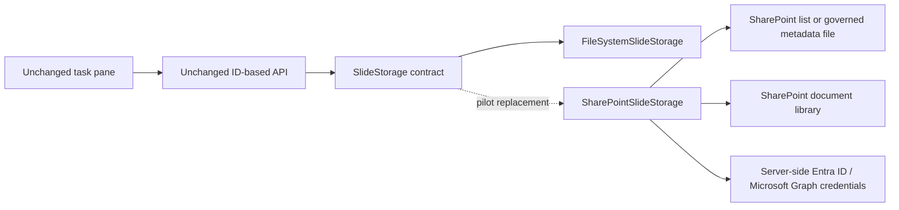

# Architecture

## Scope and invariants

The MVP is a PowerPoint task-pane web application backed by a local Node.js API. Its primary content unit is deliberately simple:

> One catalog item = one registered `.pptx` file = one slide.

That invariant lets PowerPoint insert editable native content instead of a screenshot. It is currently a content-governance invariant: the schema and validator check the `.pptx` extension and the registered file, but do not parse the package or count its slides.

Other non-negotiable boundaries are:

- The client sends catalog IDs, search terms, and filters; it never sends a filesystem path.
- Binary endpoints serve only files registered by a validated catalog item.
- Catalog and asset paths are untrusted until schema, extension, containment, real-path, and file checks pass.
- Office.js stays behind `PowerPointService`; normal browser development must remain useful.
- Shared API/domain types live in `packages/shared` and are consumed by both applications.

The original implementation plan and decisions are retained in [TECHNICAL_PLAN.md](TECHNICAL_PLAN.md).

## System topology



The Vite development server is the HTTPS origin consumed by the task pane. It proxies `/api` to the HTTP API at `127.0.0.1:3001`, avoiding mixed-content calls from an HTTPS Office frame. Browser mode uses the same topology over HTTP and substitutes a browser-only PowerPoint service.

## Component responsibilities

| Component | Responsibility | Deliberately does not own |
| --- | --- | --- |
| `apps/addin` | Task-pane UX, filter state, API requests, insertion orchestration, user-facing states | Filesystem paths, catalog validation, server credentials |
| `HttpSlideLibraryApi` | Typed request URLs, response/error handling, deferred public and personal binary download | Office.js and local storage |
| `PowerPointService` | A narrow capability boundary for slide and visual-asset insertion | Search, filtering, catalog storage |
| `OfficePowerPointService` | PPTX insertion through `PowerPoint.run`; raster/SVG insertion through Office selection coercion | Browser fallback behavior and content ingestion |
| `BrowserPowerPointService` | Explicit unavailable reason and a non-fake insertion error | Any Office call |
| `apps/server` | HTTP contract, filtering, CORS, headers, error mapping, structured request logs | UI state and Office host calls |
| `SlideStorage` | Catalog/item/binary lookup and refresh contract | HTTP-specific behavior |
| `FileSystemSlideStorage` | Validated catalog cache and safe reads of registered local files | Authentication, SharePoint, preview generation |
| `packages/shared` | Runtime catalog schema and shared TypeScript response types | Application-specific logic |
| `tools` | Library validation, local index check, and optional Windows import | A production admin workflow |

## Frontend/backend boundary

The API surface is ID-based:

| Method and route | Behavior |
| --- | --- |
| `GET /api/health` | Returns `{ "status": "ok" }` if the process can answer. It does not revalidate every asset. |
| `GET /api/slides` | Returns filtered items, filtered `total`, and all catalog categories. Optional `q`, `category`, and `status` can be combined. |
| `GET /api/slides/:id` | Returns one registered item's metadata. |
| `GET /api/slides/:id/preview` | Reads the item's registered image and sends its image content type. |
| `GET /api/slides/:id/file` | Reads the item's registered PPTX with the Open XML presentation content type. |
| `GET /api/personal-assets` | Returns locally registered personal PPTX, photo, illustration, and logo metadata. |
| `POST /api/personal-assets` | Validates and stores one uploaded personal asset under a server-generated ID. |
| `GET /api/personal-assets/:id/file` | Sends only the binary registered for the supplied personal-asset ID. |
| `DELETE /api/personal-assets/:id` | Removes one registered personal asset and its binary after UUID validation. |
| `POST /api/admin/reindex` | Exists only when `ENABLE_ADMIN_REINDEX=true`; force-refreshes the in-process catalog cache. |

Search is an in-memory normalized substring match across title, description, category, tags, and optional `searchText`. Category comparison is case-insensitive equality. Status must be one of the three shared enum values. There is no pagination in the MVP.

API errors use one public shape:

```json
{
  "error": {
    "code": "SLIDE_NOT_FOUND",
    "message": "The requested slide was not found"
  }
}
```

The server adds a request ID and `X-Content-Type-Options: nosniff`, maps expected storage failures to stable codes, and logs request metadata. It does not log binary data or Base64 strings.

## Storage and path-safety boundary

`FileSystemSlideStorage` resolves its configured root once and loads `catalog.json` through the shared Zod schema. A successful cache replacement is all-or-nothing; an invalid new catalog does not partially replace the previous in-memory index.

For catalog paths, the shared schema requires:

- a nonempty relative path using `/`, not `\`;
- no drive/URI colon, leading slash, empty segment, `.` segment, or `..` segment;
- `.pptx` for a source and PNG/JPEG/WebP for a preview.

Before a binary read, the storage layer also resolves the path under the root, resolves real paths, requires a regular file, and rejects a symlink/junction escape. A route parameter is validated as a kebab-case ID and looked up in the in-memory catalog; it is never appended to a directory as a filename.

There are two validation depths:

1. Runtime catalog loading validates JSON, item schema, and duplicate IDs. Individual binaries are rechecked when requested.
2. `npm run validate-library` additionally walks every registered source and preview, verifies that each exists as a file, and checks its resolved containment. `npm run check` runs this full validation.

Neither depth currently opens an Open XML package to prove that it is a healthy PowerPoint file with exactly one slide. That is recorded as an MVP limitation and remains a manual publication check.

## Catalog cache and content freshness

The storage adapter keeps metadata and an ID map in memory. Before catalog access it compares `catalog.json` modification time and size with the cached signature. A normal edit therefore reloads on the next API request. PPTX and preview bytes are not held in this cache; a registered binary is read on each binary request.

`refresh()` bypasses the signature check and is used at startup and by the gated admin route. The `reindex-library` CLI validates and constructs an index in its own short-lived process; it proves that the index can be built but does not signal or mutate an already-running server.

## Office boundary and insertion flow

The factory first verifies that both Office and PowerPoint globals exist, waits briefly for `Office.onReady()`, confirms the PowerPoint host, and checks `Office.context.requirements.isSetSupported("PowerPointApi", "1.2")`. If the core slide-insertion capability is unavailable, it returns `BrowserPowerPointService` with an actionable reason. Image insertion is detected independently through `ImageCoercion 1.1`; SVG insertion additionally requires `ImageCoercion 1.2`, so an older compatible host can still insert PPTX slides.

The XML manifest also declares `PowerPointApi 1.2`. Microsoft lists `insertSlidesFromBase64` in that requirement set; availability depends on the PowerPoint platform and build. See the official [`Presentation.insertSlidesFromBase64` reference](https://learn.microsoft.com/en-us/javascript/api/powerpoint/powerpoint.presentation), [PowerPoint requirement-set matrix](https://learn.microsoft.com/en-us/javascript/api/requirement-sets/powerpoint/powerpoint-api-requirement-sets), and [runtime requirement checks](https://learn.microsoft.com/en-us/office/dev/add-ins/develop/specify-api-requirements-runtime).



The service does not provide `sourceSlideIds`, so PowerPoint inserts every slide in the source file; the one-slide content invariant is therefore important. It does not provide `targetSlideId`, so the API's default placement applies (the beginning of the target presentation). It explicitly requests `KeepSourceFormatting`.

Personal PPTX files reuse the same Base64 insertion path. Raster photos, illustrations, and logos are downloaded only after the user presses **Добавить**, converted to Base64, and passed to `Office.context.document.setSelectedDataAsync` with image coercion. Sanitized SVG illustrations and logos are passed as XML with `XmlSvg` coercion. PowerPoint places the visual on the active slide or into a suitable selected placeholder according to the host's selection behavior.

Personal deletion is also ID-based. The storage adapter moves the registered binary to a temporary contained path, atomically replaces the personal index, and then removes the temporary file. If the index update fails, it restores the binary before returning an error. The client never supplies a filesystem path.

## Content update flow



Publishing binaries before metadata prevents a normal reader from seeing catalog references to files that are not present yet. There is no transactional multi-file publish or locking in the MVP, so a pilot should still use a controlled content-owner process and backups. See [CONTENT_WORKFLOW.md](CONTENT_WORKFLOW.md).

## Replacing the filesystem with SharePoint

The intended pilot expansion is an adapter replacement, not a frontend rewrite:



A `SharePointSlideStorage` implementation should preserve stable item IDs and the existing `SlideStorage` methods. The existing relative `sourceFile` and `previewFile` fields can remain registered logical keys; the adapter maps them to governed SharePoint items instead of accepting arbitrary URLs from the client. It should:

1. Authenticate server-side with Entra ID and request only required scopes.
2. Load and validate metadata through the same shared schema, or version the shared contract deliberately if SharePoint item IDs replace logical paths.
3. Resolve source and preview only from trusted library/list mappings.
4. Download bytes into the existing API response path; never give the browser a privileged Graph token.
5. Use ETags or change tokens for cache freshness and define retry/rate-limit behavior.
6. Add tenant/library allowlists, audit logging, and authorization before exposing binaries.
7. Keep Office insertion unchanged: it still receives an `ArrayBuffer` from `downloadSlide` and calls the same Office.js method.

The current API returns Node `Buffer` objects from storage implementations. A remote adapter can satisfy that contract initially; a later scale stage can evolve the binary method to streaming without changing the catalog UX or Office boundary.

## Deployment boundary

Local development has three processes/boundaries even though it is one repository:

- PowerPoint hosts the HTTPS task pane from `https://localhost:3000`.
- Vite owns the development certificate and proxies same-origin `/api` calls.
- Express listens on `127.0.0.1:3001` by default and reads the configured library root.

Changing `HOST` to a non-loopback interface, using `CORS_ORIGINS=*`, or enabling the admin endpoint expands reach without adding authentication. Those settings are development/pilot controls, not production security. A department deployment needs a real HTTPS origin, Entra-based identity and authorization, centrally deployed manifest URLs, and storage access scoped to the intended content library.
