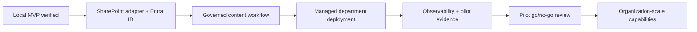

# Pilot roadmap

The roadmap separates a demonstrable local MVP from a governed department pilot and an organization-scale product. Items in later stages are proposals, not claims about the current repository.

## Stage 1 — Current local MVP

### Delivered in code

- npm-workspaces repository with shared runtime/domain contracts.
- React PowerPoint task pane and responsive catalog cards.
- Search, category/status filters, reset, count, and refresh.
- Metadata/details dialog, previews, and approval/version/update information.
- Loading, empty, no-results, API-failure, preview-fallback, insertion, and toast states.
- Express catalog API with stable ID-based metadata and binary routes.
- Filesystem `SlideStorage` adapter, catalog caching, full validation CLI, and registered-path containment checks.
- Office.js service using `insertSlidesFromBase64` and a browser-only fallback service.
- Twelve demo one-slide PPTX files with matching previews.
- Optional Windows/PowerPoint COM importer that creates one-slide files, previews, and draft metadata for review.
- Automated lint, typecheck, unit/API tests, library/manifest validation, and build commands behind `npm run check`.

### Exit checks before calling the demo complete

- Run `npm run check` successfully from a clean dependency install.
- Exercise `npm run dev:browser` and the main catalog interactions.
- Sideload the manifest into a compatible desktop PowerPoint build.
- Insert at least one demo slide and inspect the resulting editable content and source formatting.
- Exercise `npm run sideload:stop` and record any host-specific cleanup instructions.
- Keep [FINAL_CHECKLIST.md](FINAL_CHECKLIST.md) honest: an unchecked live-host item is not complete.

## Stage 2 — Department pilot

Goal: move from one developer workstation to a controlled group with identity, governed content, and supportability.

### Storage and identity

- Implement `SharePointSlideStorage` behind the existing `SlideStorage` interface.
- Store governed PPTX/preview files in a department SharePoint document library and metadata in a controlled list or validated catalog artifact.
- Add Entra ID sign-in and server-side Microsoft Graph access with least-privilege scopes.
- Authorize catalog and binary reads; do not rely on CORS as access control.
- Use SharePoint item IDs/ETags or change tokens for deterministic cache invalidation.

### Content operations

- Define content-owner and approver roles with an auditable publish checklist.
- Add server-side PPTX package validation, exact one-slide counting, file-size limits, and security scanning.
- Provide an admin/import experience with review, preview verification, approve/deprecate actions, and atomic publication.
- Retain immutable versions and a tested rollback path.
- Define ownership, review dates, expiry policy, and incident/removal procedure.

### Deployment and compatibility

- Host the task pane and API on managed HTTPS endpoints; replace every localhost URL in the pilot manifest.
- Deploy the add-in to a pilot group through the Microsoft 365 integrated apps/admin workflow.
- Establish supported PowerPoint versions/platforms using the official requirement-set matrix.
- Test insertion, formatting, error handling, accessibility, proxy/firewall behavior, and Office cache updates on that matrix.
- Add environment-specific configuration and secret management; keep credentials out of the client and repository.

### Observability and feedback

- Add privacy-reviewed metrics for API latency, catalog failures, insertion success/failure, and content usage.
- Add trace correlation across task pane, API, and storage without collecting presentation contents.
- Define dashboards, alerts, support ownership, and an opt-in user-feedback channel.
- Run a time-boxed pilot with agreed success measures: find time, insertion success, reuse rate, freshness incidents, and user satisfaction.

### Stage 2 exit criteria

- Only authorized pilot users can list and download permitted content.
- Content owners can publish and roll back without editing production storage by hand.
- A tested centrally deployed manifest reaches the target PowerPoint matrix.
- Usage and failure telemetry is actionable and privacy-approved.
- Security, content governance, support, and recovery owners accept the pilot.

## Stage 3 — Organization scale

Goal: support multiple business units with enterprise governance and predictable operations.

### Product and governance

- Multi-department catalogs, delegated ownership, RBAC, and tenant-wide policy.
- Configurable approval workflows, review/expiry automation, legal/compliance holds, and complete version history.
- Collections, favorites, recent content, recommendations, and localized metadata/UI where justified by measured demand.
- A transparent content-ranking model with administrative controls and feedback.

### Platform and data

- A versioned API contract with pagination, efficient indexed search, and backward-compatible clients.
- Resilient storage access, caching, throttling/backoff, regional considerations, and disaster recovery.
- Organization analytics with privacy thresholds, retention, and department-level reporting.
- Automated ingestion pipelines, preview rendering, validation, malware/DLP checks, and release promotion across environments.

### Enterprise delivery

- Managed rollout rings, change communication, rollback, Office compatibility monitoring, and service ownership.
- Security review, threat model, penetration testing, accessibility conformance, and compliance evidence.
- Capacity tests, SLOs, on-call/incident procedures, and cost controls.

### Stage 3 exit criteria

- The service meets approved security, privacy, accessibility, reliability, and support standards.
- Department onboarding and content governance are repeatable without engineering intervention.
- Platform and Office updates are validated through automated and host-based regression suites.
- Product expansion is driven by pilot evidence rather than adding unmeasured complexity.

## Suggested sequencing

The highest-risk Stage 2 work is the real Office/client compatibility and identity/storage boundary, not new catalog UI features. Preserve the existing ID-based API and `PowerPointService` boundary while those risks are retired.
